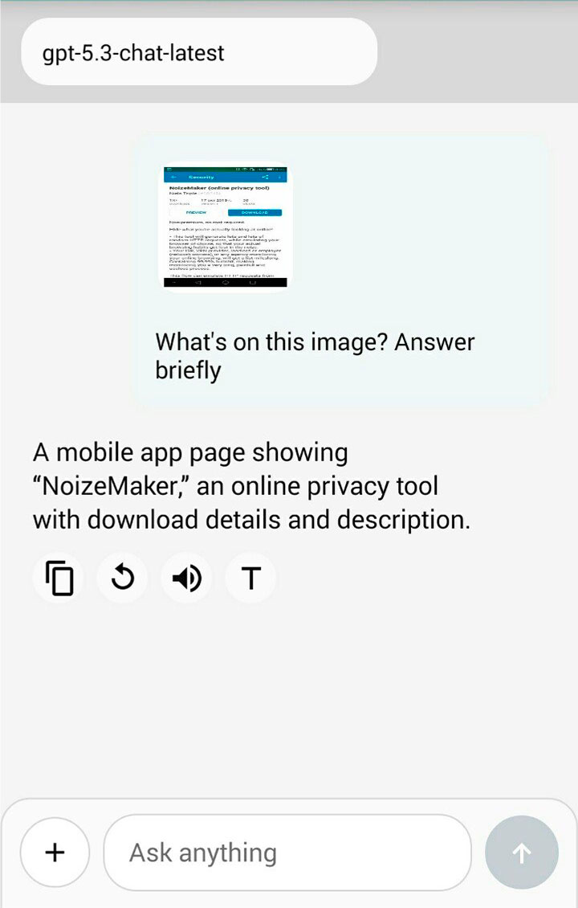
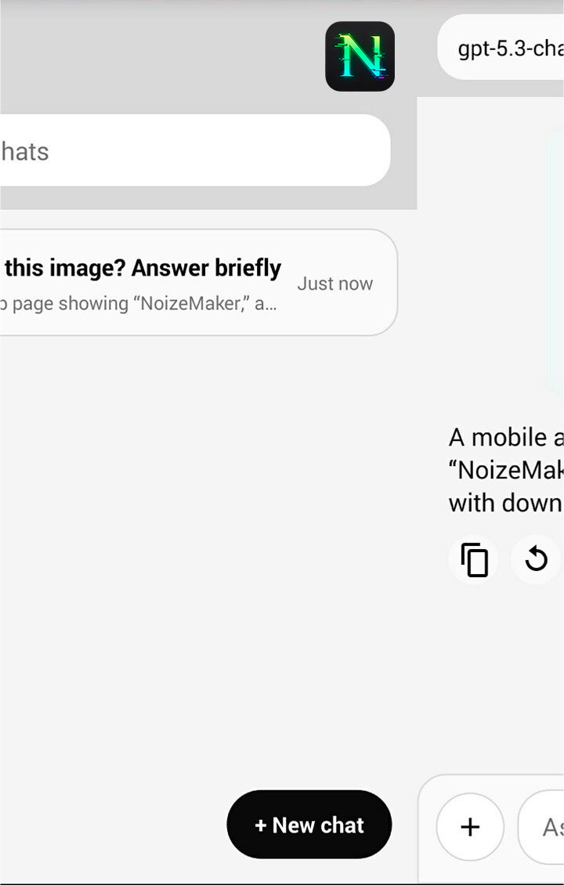
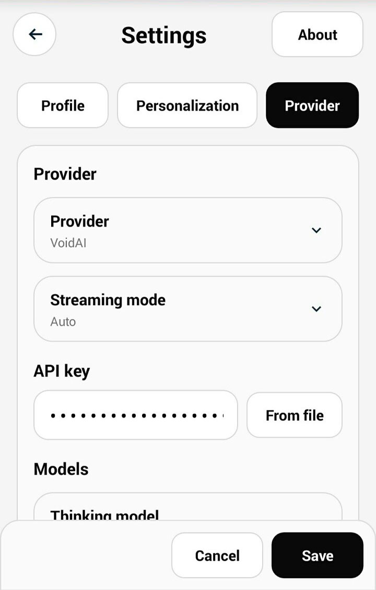

# NumAI Plus

[English](README.md) / **Русский**

NumAI Plus — современный форк [NumAI](https://github.com/gohoski/numAi).
Оригинальный проект делает упор на экстремальную совместимость с Android 1.0+.
Этот форк идет в другую сторону: более удобный клиент, более чистый интерфейс, нормальная работа с чатами и расширенная персонализация для старых, но еще актуальных устройств.

NumAI Plus ориентирован на **Android 4.0+**.

## Сообщество

Telegram (RU): https://t.me/lev_landon)
Twitter / X (EN): https://x.com/lev_landon

## Скачать

[numAI-Plus-0.2.0-release.apk](https://github.com/levlandon/numAi-plus/releases/download/V0.2.0/numAI-Plus-0.2.0-release.apk)

## Скриншоты

## Что Меняет NumAI Plus

- Современный форк NumAI
- Список чатов с локальной историей, поиском, переименованием и удалением
- Более современный чат-интерфейс и bubble-кнопки
- Персонализация пользователя: ник, аватар, роль, цели, стиль, детализация, эмоциональность
- Дополнительные инструкции для ассистента поверх обычного system prompt
- Более удобная работа с локальными и облачными провайдерами
- Раздельная настройка chat-модели и thinking-модели

## Возможности

- Работа со многими **OpenAI-совместимыми API**
- Готовые провайдеры: `VoidAI`, `Ollama`, `NavyAI`, `OpenRouter`, `Baseten`, `Gemini`, `Together`, `Upstage`, `LM Studio`
- Поддержка своего URL провайдера
- Хранение нескольких чатов в локальной SQLite-базе
- Поиск по чатам
- Thinking mode с отдельным выбором reasoning-модели
- Стриминг ответов с авто-фолбэком, если у провайдера потоковый режим работает криво
- Vision и прикрепление изображений
- Действия над сообщениями: копирование, выделение текста, редактирование, регенерация, повтор
- Озвучка ответов через TTS
- Выбор и обрезка аватара
- Интерфейс на английском и русском
- Проверка подключения и диагностика провайдера

## Быстрый Старт

1. Установите APK из [Releases](https://github.com/levlandon/numAi-plus/releases).
2. Откройте **Settings**.
3. Выберите провайдера или укажите свой OpenAI-совместимый endpoint.
4. Вставьте или импортируйте API key.
5. Загрузите модели и выберите chat / thinking модели.
6. Начинайте чат.

## Где NumAI Plus Особенно Полезен

- Старые смартфоны и планшеты, где современные тяжелые клиенты работают плохо
- Локальные LLM через `Ollama` или `LM Studio`
- Облачные LLM через OpenAI-совместимые сервисы
- Персональный AI-клиент с настройкой поведения под себя

## Совместимость

- Upstream NumAI нацелен на Android `1.0+`
- NumAI Plus ориентирован на **Android 4.0+**
- Главная цель форка: старые устройства, которым нужен более современный UX, чем у upstream-версии

Если нужна максимальная историческая совместимость, смотрите оригинальный [NumAI](https://github.com/gohoski/numAi).
Если нужны чаты, более удобное управление и персонализация, используйте NumAI Plus.

## Сборка

Проект использует классическую структуру Android/Gradle.

Варианты сборки:

- Android Studio
- `gradlew.bat assembleDebug`
- `gradlew.bat assembleRelease`

## Текущее Направление Развития

- Улучшение UX для нескольких чатов
- Новые провайдеры из коробки
- Дополировка интерфейса на старых Android
- Дальнейшая модернизация без превращения приложения в тяжелый клиент

## Баги И Обратная Связь

- Issues: [github.com/levlandon/numAi-plus/issues](https://github.com/levlandon/numAi-plus/issues)
- Upstream-проект: [github.com/gohoski/numAi](https://github.com/gohoski/numAi)

При репорте бага укажите:

- версию Android
- модель устройства
- провайдера
- выбранную модель
- был ли включен стриминг

## Благодарности

- Оригинальный проект: [gohoski/numAi](https://github.com/gohoski/numAi)
- NNJSON: [shinovon/NNJSON](https://github.com/shinovon/NNJSON)
- Этот форк продолжает идею оригинала, но двигает клиент в сторону более современного опыта использования

## Лицензия

Проект наследует схему лицензирования оригинала:

- основной проект: [WTFPL v2](LICENSE)
- NNJSON: [MIT](LICENSE-NNJSON)
